# はじめに - 3Dプリントフェイスシールド　Wakyu モデル  (学校用)

フェイスシールド 「Wakyu」 モデルは、幼稚園や学校での使用を想定した、3Dプリントでつくるオープンソースのフェイスシールドです。
慶應義塾大学SFC研究所ソーシャルファブリケーションラボ（代表：環境情報学部教授　田中浩也）の、湯浅亮平上席所員と、
ラボの卒業生で、現在はエス.ラボ株式会社に所属する脇本智正氏に共同設計され、両名の頭文字から「Wakyu」モデルと名付けられました。

S/M/Lのサイズを用意してあり、改変・配布・販売も可能です（下記のクリエイティブコモンズライセンスに準じてください）。
シールドの上部に「着せ替えシート」を取り付け、ワンポイントのカスタマイズができる設計となっています。

みなさまの使っている姿を見せていただいたり、感想をお寄せいただけいただけるのであれば、SNSで#wakyumodel とハッシュタグをつけて投稿もしくは、
tanakalab-sfc@googlegroups.com にお願いいたします。カスタマイズのアイディアや、実際に使用している姿を見せていただけると大変嬉しいです。

田中浩也/ 湯浅亮平 / 脇本智正  

# 聾学校への展開について

なお、このデータをもとにしたフェイスシールドは、プロクター・アンド・ギャンブル・ジャパン(P&G)株式会社、エス．ラボ株式会社、株式会社丹青社、テラサイクルジャパン合同会社、ナノダックス株式会社と当ラボの連携のもと、約１万個が3Dプリントされ全国の聾学校等へ寄贈されました。

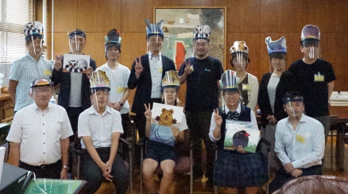

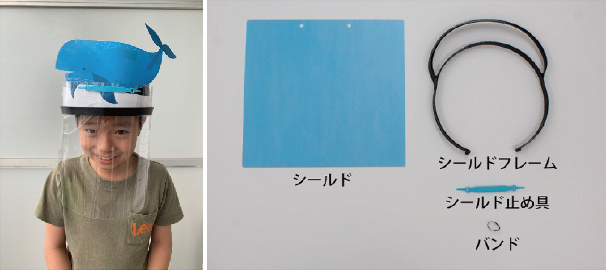

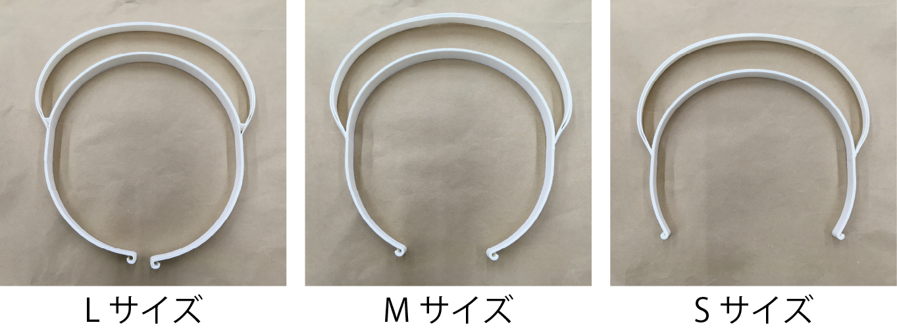

# プロジェクトパートナー関連リンク

・[プロクター・アンド・ギャンブル・ジャパン株式会社によるプレスリリース　(本取り組みの背景および参画各社の役割) ](https://prtimes.jp/main/html/rd/p/000000031.000031986.html)

・[丹青社による独自サイト (フェイスシールドの着せ替えシートデザインの無償公開) ](https://www.tanseisha.co.jp/news/info/2020/post-33843)

・[エス．ラボ株式会社　(フェイスシールドそのものの注文・購入を希望する場合)](http://slab.jp/)

# 公開した3Dデータの説明

フィラメント式のデスクトップ3Dプリンタで出力する場合、フォルダに公開したデータのうち「Wakyu_Large.stl」が大サイズ、「Wakyu_Middle.stl」が中サイズ、「Wakyu_Small.stl」が小サイズになっています。どのデータも「透明シールド」を差し込むための溝の設計がカギです。スライス時に、その「溝」をサポート材で埋めたりせずに、かつ寸法通り正しい幅で出力するために、3Dプリンタのノズルは0.4mmを強くお勧めします。

# 使用可能なフィラメント

繰り返し使用するためには高温消毒・アルコール消毒が可能で、かつ頭部に柔らかいPP (ポリプロピレン）が有力であると考えられます。
PP (ポリプロピレン）のフィラメントのうち、安定した3Dプリントを行うために収縮抑制のグラスウールを混ぜたナノダックス社の「3D-MAGIC」をお勧めします。
[ナノダックス社「3D-MAGIC」](http://nanodax.jp/3Dfilament.html)

# シールド部について(材質・型紙)

本Wakyuモデルは 透明度が非常に高く、除菌・消毒作業に対応する為、ポリカーボネートを使用したシールドを用いております。
シールドの大きさは 横 265 mm × 高さ250 mm です。
シールド留め具の寸法は一般的なパンチの穴径・距離になっています。
書類留めに使うバンドなどをお使いください。

ポリカーボネート製シールド部分の単品販売も行う予定ですので、お問い合わせください。
[販売サイト”秘密基地”](https://item.rakuten.co.jp/auc-himitsukichi/c/0000000001/)

多くの方にお使い頂けるよう、シールド部分は大きめに作成しております。
カットをするための型紙を用意いたしましたので、ダウンロードしプリントしてお使いください。
A3用紙で印刷することで、適切な型紙サイズとしてお使い頂けます。
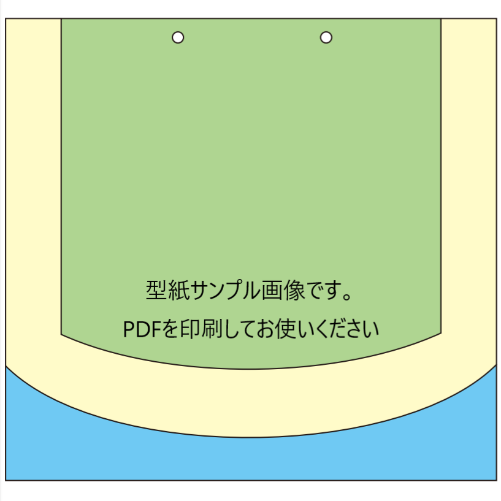

# 印刷設定(スライサーの設定)

フェイスシールドを一般的なフィラメントタイプのプリンターでプリントするには細かな印刷設定が必要です。
いくつかのパラメータを変更することで、印刷時間を短縮し、より仕上がりが良く着け心地の良いフレームをプリントする事ができます。

２つのスライサーのお勧めする印刷設定を紹介します。

### [Simplify3D](https://www.simplify3d.com/)での詳細設定

#### アウトラインは2層が推奨です
スタート地点を固定することで、短時間かつ、美しい造形が可能です。
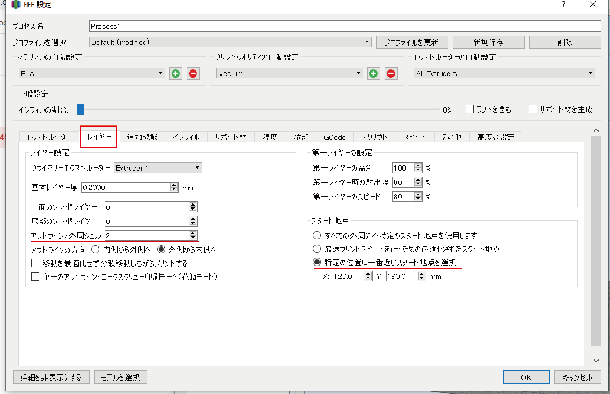

#### インフィルはできるだけ0%にしてください
印刷後に壁の接着が弱い場合は”アウトラインの重なり”の数字を大きくすることで、接着具合が上がります。(上げすぎ注意)
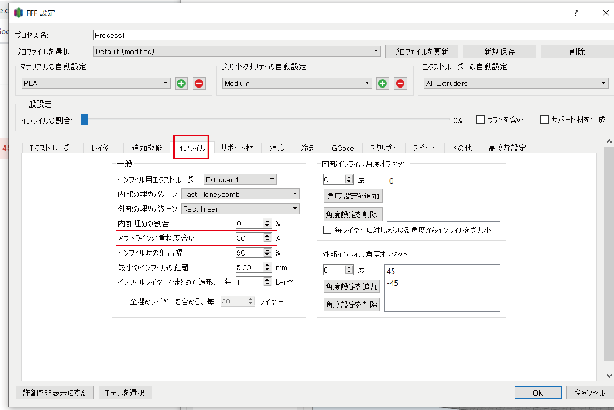

#### ※モデルが非常に薄い為、高度な設定の”薄壁生成時の動作”を必ず変更し、画像のようにしてください。
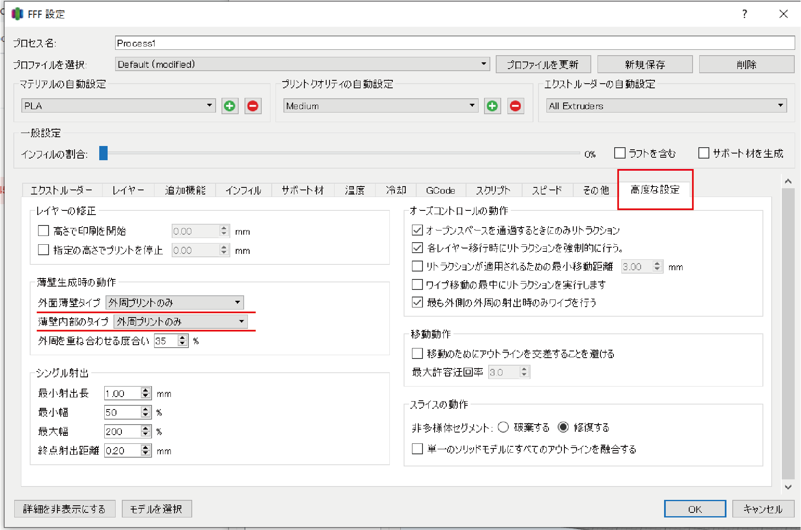

#### スライスした状態
フレーム全体
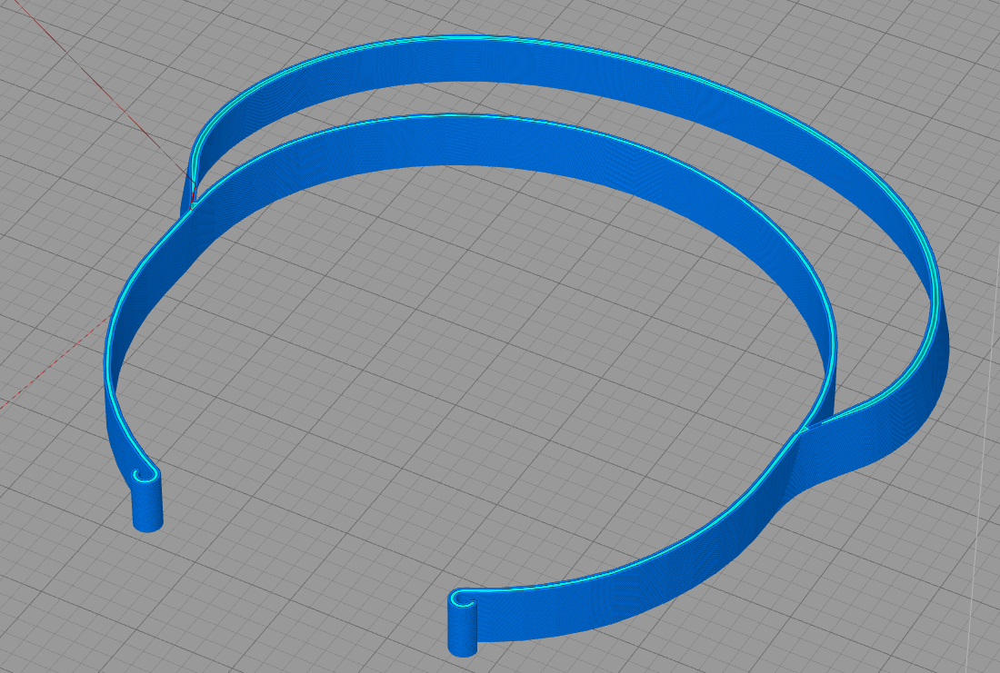

スリット部分
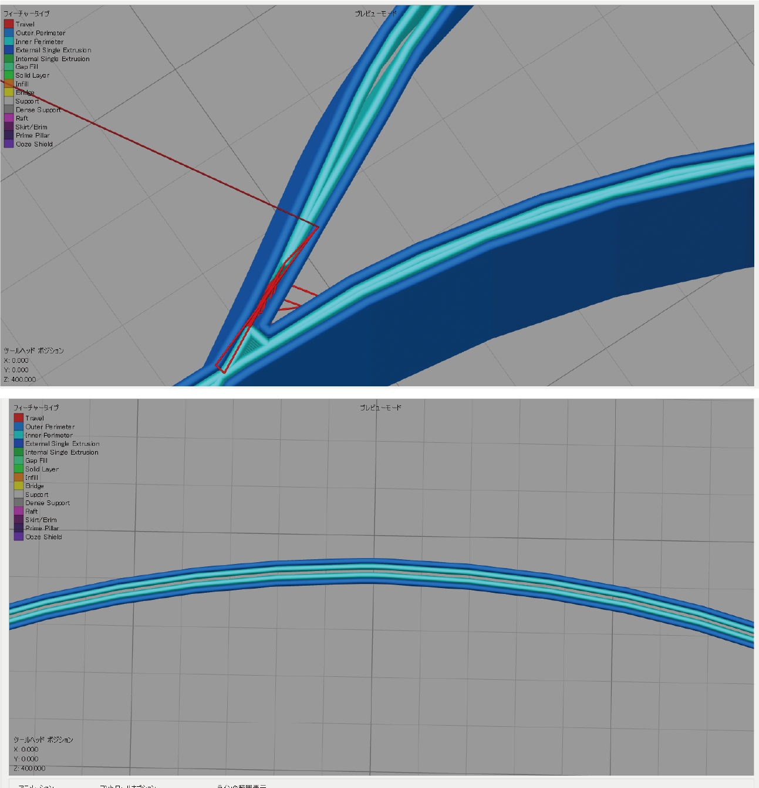

### [Ultimaker Cura](https://ultimaker.com/ja/software/ultimaker-cura) での詳細設定

#### Curaの設定を変更する。
(EN) Preferences   -> Configure Cura  -> Setting
(JP) プレファレンス -> Curaを構成する　 -> 設定
からスライス設定の項目を追加する。
Basicの状態からいくつかを追加するだけで良いです。

#### 印刷設定のサンプル
重要な設定ポイントは、Line Width とWall Line Count です

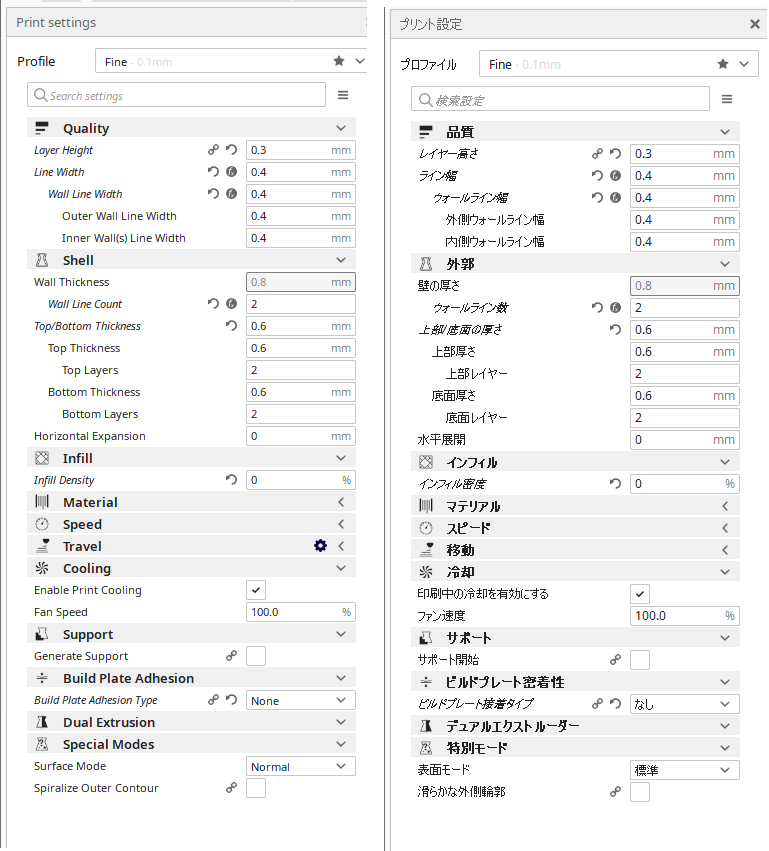

スライスサンプル
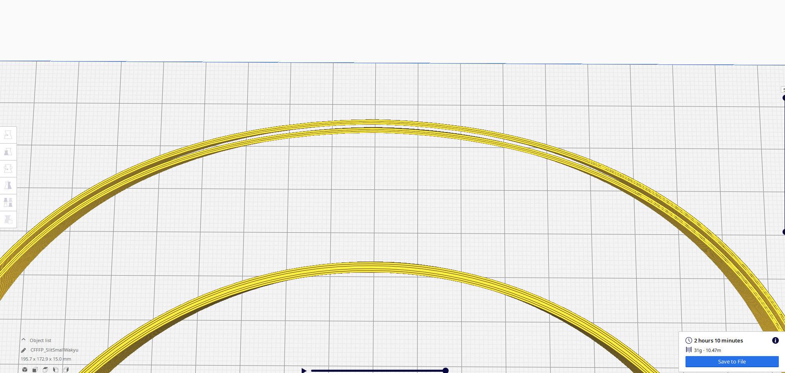
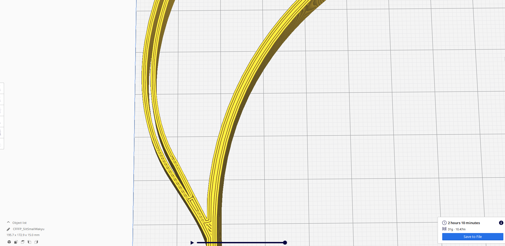

# 作ったものを他人に渡す場合の注意

[フェイスシールドを安全に作って渡すためのガイドラインドキュメント](https://fabsafehub.org/faceshield)

# （研究開発中）パラメトリック・モデル (Thingiverse Customizr機能への公開)

頭のうらの「つる」の部分の長さだけを自由に改変できる、パラメトリック・モデルを作成し、世界的な3Dデータレポジトリ「Thingiverse」に公開しました（ベータ版です）。https://www.thingiverse.com/thing:4431372

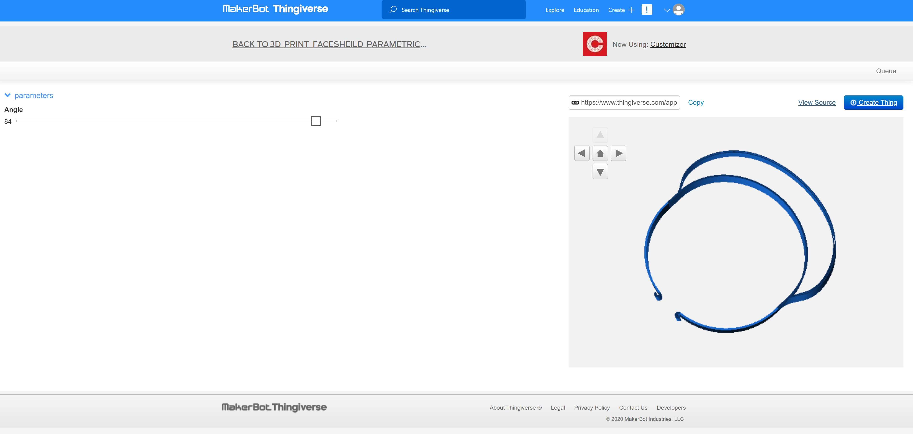
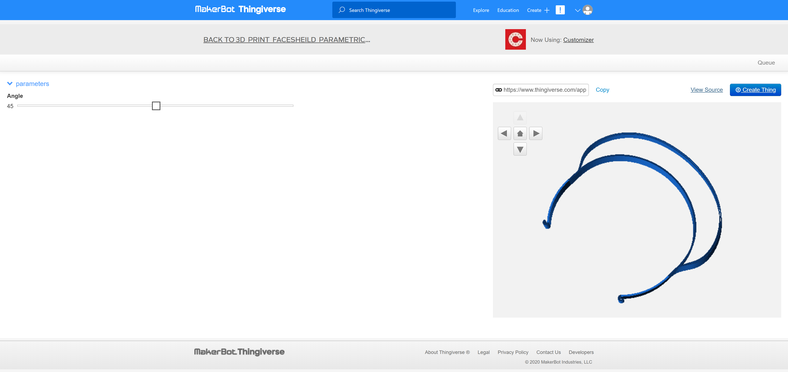

「Customizer」という機能を使うことで自由につるの長さを変更できます。

# （研究開発中）パラメトリック・モデル (独自のカスタマイズサイトの開発) ※開発中

独自のパラメトリック・モデル改変インターフェイスを研究開発中です。

https://fab.sfc.keio.ac.jp/openjscad/packages/web/

